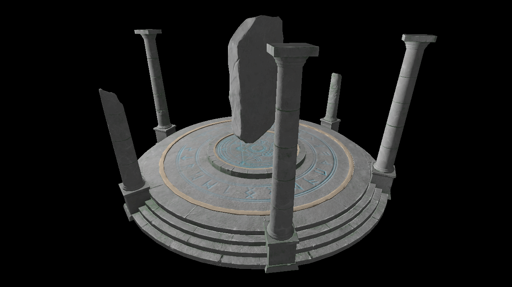

# VkMana

[](https://github.com/stuart6854/VkMana/actions/workflows/build_cmake_windows.yaml)
[](https://github.com/stuart6854/VkMana/actions/workflows/build_cmake_linux.yaml)

A C++20 Vulkan library.

This library is designed as a simplified interface to Vulkan to be used for my own personal Games & Graphics projects.



## Requirements

- Vulkan 1.3
- VulkanMemoryAllocator-Hpp

# How to use

This library uses the [CMake](https://cmake.org) build system and [CPM](https://github.com/cpm-cmake/CPM.cmake) for automatic dependency management.

To clone:

```shell
git clone --recursive https://github.com/stuart6854/VkMana.git
```

To build:
```shell
cd ./VkMana
mkdir build
cd build
cmake -DCMAKE_BUILD_TYPE=Release ..
cmake --build . --config Release
```

**_Important_**: The sample app must be run from the project root (so it can access the assets).

